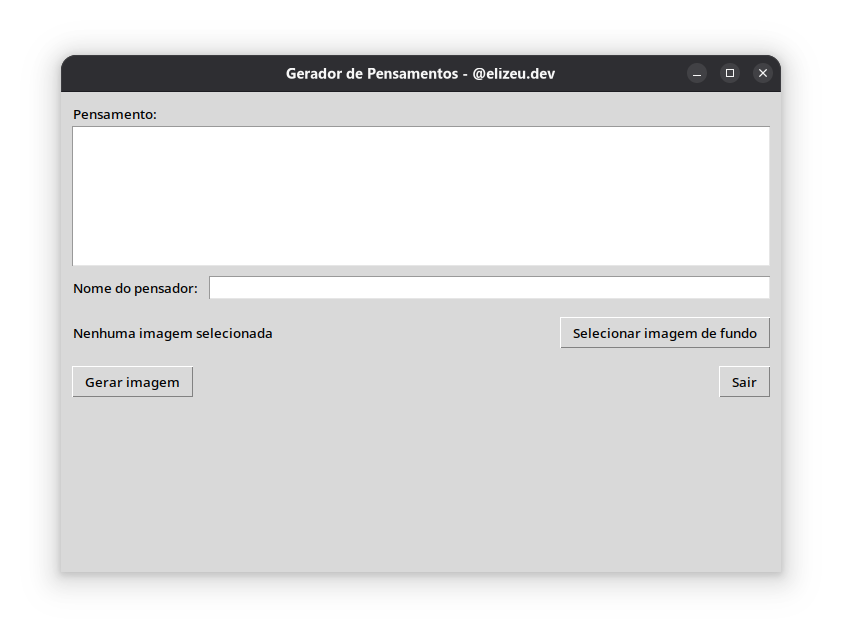

# Gerador de Imagens de Pensamentos

Aplicativo gráfico em **Python** que cria imagens verticais (1080x1920) com um pensamento, o nome do autor e um fundo desfocado.  
Ideal para criar conteúdos para redes sociais com design elegante e legibilidade garantida.  



Resultado:


## ✨ Funcionalidades
- Interface gráfica simples usando **Tkinter**
- Entrada de:
  - Pensamento
  - Nome do autor
  - Imagem de fundo
- Ajuste automático de tamanho de fonte para melhor encaixe
- Fundo desfocado para maior legibilidade do texto
- Rodapé com o arroba `@elizeu.dev`
- Exporta no formato **PNG** (1080x1920)

## 📦 Instalação

### 1️⃣ Clonar o repositório
```bash
git clone https://github.com/elizeubarbosaabreu/gerador_de_imagem_de_pensamentos
cd gerador_de_imagem_de_pensamentos
````

### 2️⃣ Criar um ambiente virtual (recomendado)

No **Windows**:

```bash
python -m venv venv
venv\Scripts\activate
```

No **Linux/Mac**:

```bash
python3 -m venv venv
source venv/bin/activate
```

### 3️⃣ Instalar as dependências

```bash
pip install -r requirements.txt
```

## 🚀 Como usar

Execute o aplicativo:

```bash
python gerador_pensamentos.py
```

1. Digite o pensamento.
2. Informe o nome do pensador.
3. Escolha uma imagem de fundo (formato JPG, PNG ou WebP).
4. Clique em **Gerar imagem** e escolha onde salvar.

A imagem final será salva com resolução de **1080x1920**, pronta para uso em redes sociais.

## 🛠 Criando um executável com PyInstaller

Para distribuir seu aplicativo sem exigir que o usuário instale Python, use o [PyInstaller](https://pyinstaller.org/).

Instale o PyInstaller:

```bash
pip install pyinstaller
```

Gere o executável (sem console aberto junto):

```bash
pyinstaller --noconsole gerador_pensamentos.py
```

O executável será criado na pasta `dist/`.

## 📄 Licença

Este projeto está sob a licença MIT. Sinta-se livre para usar e modificar.
